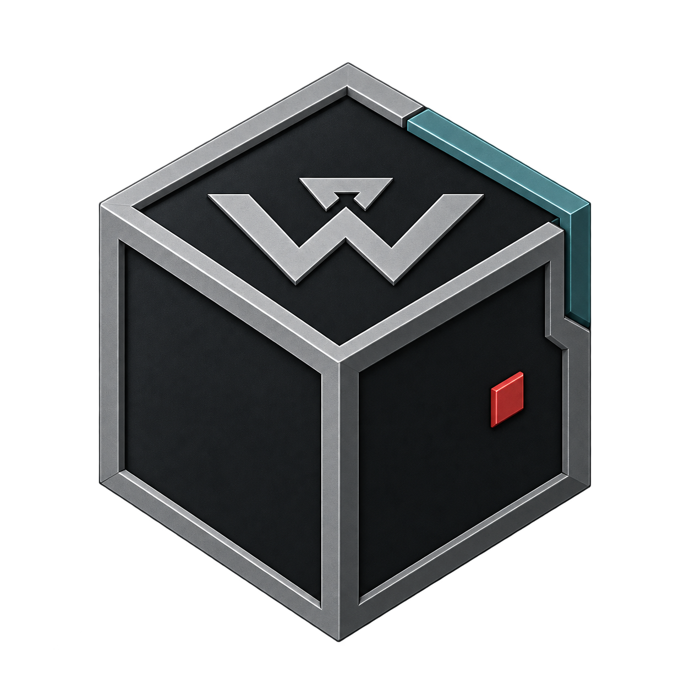
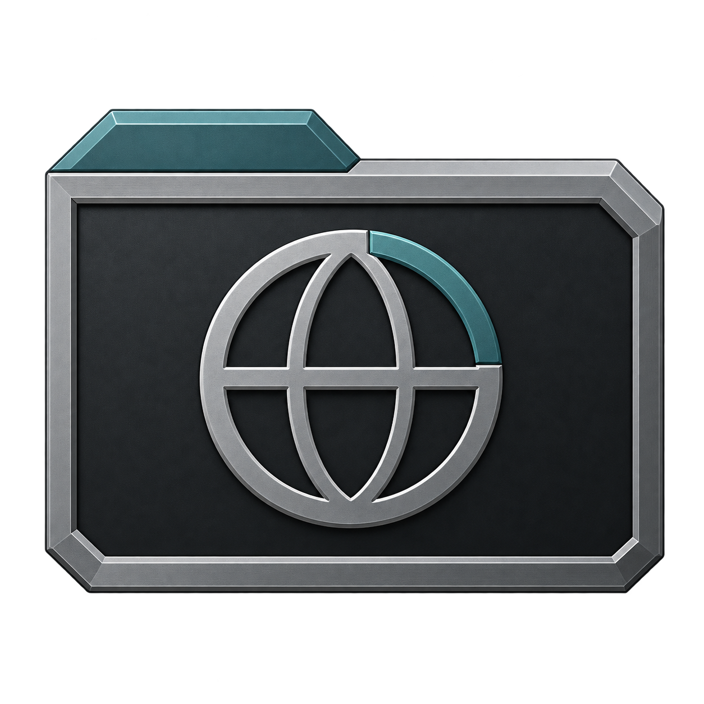
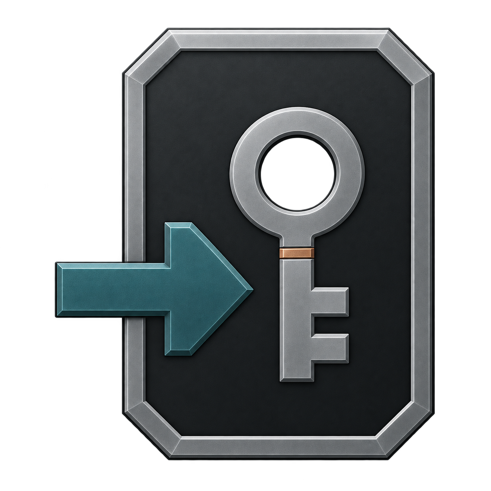
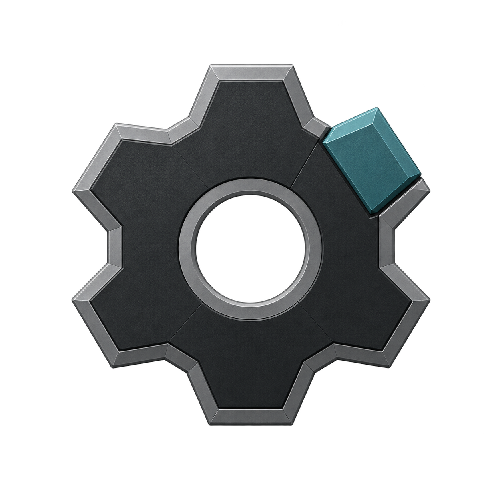

# WitnessOps Plasma Theme

A home for WitnessOps appearance components for KDE Plasma.

**WitnessOps Icon Set v1.0** is the first implemented component. Its Machined
Carbon direction uses graphite surfaces, steel edges and restrained petrol
accents, while keeping different applications and folder types recognizable.
Plasma themes, wallpapers, cursors and Konsole profiles remain reserved folders.

See [ICONSET.md](ICONSET.md) for requirements, installation, verification,
rollback and packaging. The icon set uses the freedesktop format; the supplied
activation helper targets Plasma 6.

| AI CLI | BLACK BOX | Browser | Credential Import | VSCodium | Screenshot | Settings |
| --- | --- | --- | --- | --- | --- | --- |
|  |  |  |  |  |  |  |

## Repository layout

| Path | Purpose |
| --- | --- |
| `assets/` | Source artwork and its provenance |
| `packages/` | Distributable appearance components |
| `packages/icon-set-v1.0/` | Complete Icon Set v1.0 package |
| `packages/wallpapers/` | Placeholder for wallpapers |
| `packages/konsole/` | Placeholder for Konsole profiles and color schemes |
| `packages/cursors/` | Placeholder for cursor themes |
| `packages/plasma/color-schemes/` | Placeholder for Plasma color schemes |
| `packages/plasma/desktoptheme/` | Placeholder for Plasma desktop themes |
| `packages/plasma/look-and-feel/` | Placeholder for Plasma look-and-feel packages |
| `packages/plasma/window-decorations/` | Placeholder for window decorations |
| `tools/` | Build, preview and maintenance helpers |
| `tests/` | Checks for implemented components |
| `licenses/` | Component licenses and attribution records |
| `docs/` | Design decisions and validation evidence |

Installation instructions, supported Plasma versions and validation results will accompany each implemented component. See [CONTRIBUTING.md](CONTRIBUTING.md) before adding one.

## License

Repository-owned code, documentation and authored artwork use [Apache-2.0](LICENSE). Third-party artwork retains its own license and attribution, recorded with the component that includes it.
